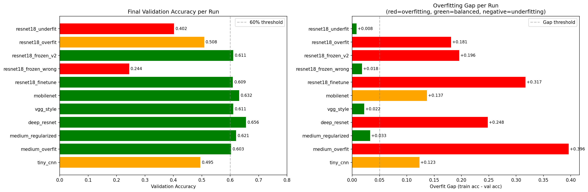

# facial-expression-recognition

ეს პროექტი ეხება Kaggle-ის "Facial Expression Recognition Challenge"-ს. მიზანი იყო არა მხოლოდ მაღალი სიზუსტის მიღწევა, არამედ ნეირონული ქსელების ქცევის შესწავლა იტერაციული მიდგომით, ჰიპერპარამეტრების ოპტიმიზაცია და მოდელის health-ის მონიტორინგი WandB პლატფორმის გამოყენებით.

## 1. მონაცემთა ანალიზი და სტრატეგია
მუშაობის დაწყებამდე პირველი ნაბიჯი იყო მონაცემთა შესწავლა (EDA). FER2013 მონაცემთა ბაზა შედგება 48x48 პიქსელიანი ნაცრისფერი გამოსახულებებისგან. ანალიზისას გამოიკვეთა კრიტიკული დისბალანსი კლასებს შორის: მაგალითად, "Happy" კლასს აქვს 7,000-ზე მეტი ნიმუში, ხოლო "Disgust"-ს მხოლოდ 436.იმისათვის, რომ მოდელს არ მოეხდინა მხოლოდ დომინანტი კლასების პრიორიტეტიზაცია, Cross-Entropy Loss ფუნქციაში გამოვიყენე Class Weights. ამან აიძულა მოდელი, უფრო მეტი ყურადღება დაეთმო იშვიათი კლასებისთვის, რაც აისახა კიდეც საბოლოო confusion matrix-ში.

## 2. იტერაციული არქიტექტურული განვითარება
ეტაპი 1: TinyCNN საწყისი წერტილი (Underfitting-ის ჩვენება)
თავდაპირველად შევქმენი ძალიან მარტივი არქიტექტურა (TinyCNN) ორი Convolutional ფენით და მცირე რაოდენობის ფილტრებით (8 და 16).
ჩემი მიზანი იყო შემექმნა Baseline-ი. მცირე პარამეტრების გამო მოდელი აღმოჩნდა Underfitted მდგომარეობაში. ნეირონული ქსელი არის ფუნქცია, რომელიც ცდილობს იპოვოს კანონზომიერება პიქსელებსა და ემოციებს შორის. 149,000 პარამეტრი აღმოჩნდა ძალიან მცირე capacity იმისთვის, რომ მოდელს დაეჭირა ისეთი რთული ნიუანსები, როგორიცაა თვალის კუთხის მოხრა ან ტუჩის ფორმა. 

შედეგი: ვალიდაციის სიზუსტე შეჩერდა 48.5%-ზე. მიუხედავად იმისა, რომ ტრენინგი დიდხანს გაგრძელდა, მოდელმა მეტი ვერ ისწავლა.

ეტაპი 2: MediumCNN რეგულარიზაციის მნიშვნელობა (Overfitting-ის ანალიზი)
შემდეგ ეტაპზე გავზარდე მოდელის სიღრმე 4 Convolutional ფენამდე და დავამატე BatchNorm. აქ ჩავატარე ორი ექსპერიმენტი. პირველ ექსპერიმენტში გავთიშე Dropout და Data Augmentation. მოდელმა დაიწყო ტრენინგ მონაცემების დაზეპირება. WandB-ის გრაფიკებზე ნათლად გამოჩნდა, რომ Training Accuracy 99%-მდე ავიდა, ხოლო Validation Accuracy 59%-ზე გაიყინა. ეს არის კლასიკური შემთხვევა, როცა მოდელი კარგავს გენერალიზაციის უნარს.

სწორედ ამ პრობლემის გადასაჭრელად ჩავრთე dropout=0.5 და მონაცემთა აუგმენტაცია (შემთხვევითი როტაცია და ჰორიზონტალური არეკვლა). სიზუსტე გაიზარდა 61.8%-მდე, ხოლო ტრენინგისა და ვალიდაციის გრაფიკები ერთმანეთს მიუახლოვდა. ნეირონების შემთხვევითი გათიშვა აიძულებს ქსელს, არ იყოს დამოკიდებული ერთ კონკრეტულ ნეირონზე. ნეირონებმა ისწავლეს გუნდური მუშაობა და ინფორმაციის დუბლირება, რაც ზრდის მოდელის მდგრადობას. Augmentation-ის ლოგიკა: სურათების დახრით და გაფართოებით მოდელს ვეუბნებით რომ თუ სახე ცოტათი მარცხნივაა გადახრილი, ეს მაინც იგივე ემოციაა. ამით მოდელს ვუზღუდავთ პიქსელების დაზეპირების შანსს და ვაიძულებთ ისწავლოს ფორმები და კონტურები.

ეტაპი 3: DeepResNet - Residual Connections
სიღრმის კიდევ უფრო გაზრდისას (18+ ფენა), ჩვეულებრივი CNN-ები გრადიენტის გაქრობის პრობლემას აწყდებიან. ამიტომ გამოვიყენე ResNet არქიტექტურა.Skip connections საშუალებას აძლევს ინფორმაციას დაკარგვის გარეშე იმოძრაოს ფენებს შორის.ამან მომცა საშუალება მემუშავა უფრო მაღალ Learning Rate-ით (1e-3) გრადიენტების აფეთქების რისკის გარეშე. ResNet-ის "ნარჩენი კავშირები" მათემატიკურად წარმოადგენს f(x) + x ფუნქციას. ეს + x პირდაპირ გადადის წინა ფენებში ყოველგვარი შემცირების გარეშე. სწორედ ამიტომ, ამ მოდელმა აჩვენა საუკეთესო შედეგი (65.5%), რადგან მან შეძლო ყველაზე ღრმა კანონზომიერებების სწავლა.  

ეტაპი 4: VGG-Style CNN ღრმა Plain ქსელი Skip Connections-ის გარეშე
DeepResNet-ის შემდეგ გადავწყვიტე გამეტესტა ღრმა plain ქსელი skip connections-ის გარეშე VGG-ის ინსპირირებული არქიტექტურა 4 ბლოკით, სულ 3.2 მილიონი პარამეტრით. მიზანი იყო პირდაპირი შედარება DeepResNet-თან იგივე სიღრმე ყოფილიყო, თუმცა skip connections-ის გარეშე. მოდელი 5 ეპოქაზე მხოლოდ 17%-ზე იყო, სანამ DeepResNet იმ დროს უკვე 43%-ს აღწევდა. საბოლოო val accuracy 61.1%, DeepResNet-ის 65.6%-თან შედარებით. ამისი მიზეზი ისაა რომ, ღრმა plain ქსელებში backpropagation-ის დროს გრადიენტი სუსტდება ფენიდან ფენამდე გადასვლისას, ეს არის gradient vanishing-ის კლასიკური შემთხვევა. skip connections-ის გარეშე, ქსელი ვერ გრძნობს რა ხდება პირველ ფენებში.

ეტაპი 5: MobileNet-Style ეფექტური Depthwise Separable Convolutions
MobileNet-ის ინსპირირებული არქიტექტურა იყენებს Depthwise Separable Convolutions-ს, ჩვეულებრივი conv layer-ის ნაცვლად ორ ნაბიჯად იყოფა:
1. Depthwise conv - თითოეულ channel-ს ცალკე ამუშავებს (სივრცითი ნიშნები)
2. Pointwise conv (1x1) - channel-ებს ერთმანეთთან აკავშირებს

ეს მიდგომა პარამეტრების რაოდენობას დრამატულად ამცირებს. შედეგად მოდელს მხოლოდ 274,375 პარამეტრი აქვს, VGG-ს 12-ჯერ ნაკლები.
val accuracy 63.2%, VGG-ს (61.1%) 2%-ით სჯობს, მიუხედავად იმისა რომ 12-ჯერ პატარაა. რაც იმაზე მიუთითებს რომ პარამეტრების რაოდენობა პირდაპირ არ განსაზღვრავს მოდელის ხარისხს. 

ეტაპი 6: ResNet18 Transfer Learning-ის ანალიზი

ბოლო ეტაპი იყო წინასწარ ImageNet-ზე დატრენინგებული ResNet18-ის გამოყენება. Transfer Learning-ის იდეა მარტივია: მოდელს უკვე „ესმის" კიდები, ტექსტურები და ფორმები ჩვენ მხოლოდ ემოციებზე უნდა „ვასწავლოთ". თუმცა პრაქტიკაში გამოჩნდა მნიშვნელოვანი პრობლემა: ResNet18 RGB 224x224 სურათებზეა დატრენინგებული, ჩვენ კი გვაქვს grayscale 48x48 რაც მნიშვნელოვანი domain mismatch-ია.
ამ გამოწვევის გადასაჭრელად პირველი conv layer შევცვალე 1-channel-იანით და გავტესტე 4 განსხვავებული ვარიანტი:

ვარიანტი 1 Full Finetune (lr=5e-4)
მთელი ქსელი ვასწავლე. overfits train 92% vs val 61%, gap +0.317. Gradient norm ბოლო ეპოქებზე 13.4-მდე ავიდა - არასტაბილური სწავლება. 11 მილიონი პარამეტრი ჩვენი პატარა grayscale დატასეტისთვის ძალიან ბევრია.

ვარიანტი 2 Frozen Backbone (შეცდომა)
გადავწყვიტე backbone გამეყინა და მხოლოდ FC layer მესწავლა. თუმცა conv1 შემთხვევითი წონებით ჩავანაცვლე grayscale-ისთვის, შემდეგ ეს ფენაც გავყინე. შედეგად ქსელი შემთხვევით features-ს ამუშავებდა frozen ფენებში და მხოლოდ FC layer სწავლობდა. val accuracy 24.4%, თითქმის შემთხვევითი გამოცნობის დონეზე.

ვარიანტი 3 Frozen v2 (conv1 trainable)
შეცდომის გასწორების შემდეგ conv1 trainable დავტოვე, დანარჩენი backbone გავყინე. შედეგი მაშინვე გაუმჯობესდა: val accuracy 61.1%. ეს ადასტურებს, რომ grayscale adaptation-ისთვის conv1-ის სწავლება აუცილებელია.

ვარიანტი 4 და 5 Overfit/Underfit Demo
ResNet18-ზეც განზრახ ვაჩვენე ორივე failure mode:
- Overfit (lr=1e-2, augmentation გარეშე): train 68% vs val 50%, gap +0.181
- Underfit (lr=1e-5, weight_decay=0.1): val 40.2%, gap თითქმის 0 მოდელი ვერ სწავლობდა, gradient norm 30-დან იწყებდა

Transfer Learning-ის მთავარი დასკვნა: წინასწარ დატრენინგებული მოდელი ყოველთვის არ ნიშნავს უკეთეს შედეგს. Domain mismatch (RGB→grayscale, 224x224→48x48) მნიშვნელოვნად ამცირებს pretrained features-ის სარგებლიანობას. ჩვენს შემთხვევაში custom DeepResNet უკეთეს შედეგს იძლეოდა ვიდრე 11M პარამეტრიანი ResNet18.

## ჰიპერპარამეტრების შედარება და ოპტიმიზაცია
ექსპერიმენტების პროცესში რამდენიმე მნიშვნელოვანი დასკვნა გამოვიტანე:

1. Learning Rate (LR): 1e-2-ზე ResNet-მა დაიწყო არასტაბილური ქცევა (High variance), ხოლო 1e-5-ზე მოდელი პრაქტიკულად არ იცვლებოდა (Underfitting). ოპტიმალური აღმოჩნდა 1e-3 Cosine Annealing Scheduler-თან ერთად, რომელიც ეპოქების მატებასთან ერთად ნელ-ნელა ამცირებს LR-ს.

2. Optimizer: Adam-მა აჩვენა უფრო სწრაფი კონვერგენცია, ვიდრე SGD-მ, თუმცა SGD-ს შემთხვევაში მოდელი უფრო ნაკლებად ხტუნავდა ლოკალურ მინიმუმებთან.

3. Weight Decay: 1e-4 მნიშვნელობამ ეფექტურად შეამცირა Overfitting-ის რისკი DeepResNet-ის შემთხვევაში.

Adam-ის ლოგიკა: ის იყენებს "ინერციას" (Momentum) და თითოეული პარამეტრისთვის ინდივიდუალურ Learning Rate-ს. ჩემს ექსპერიმენტში Adam-მა ბევრად სწრაფად იპოვა ოპტიმალური წერტილი.
SGD-ის პრობლემა: ამ კონკრეტულ ამოცანაში SGD ძალიან ნელი აღმოჩნდა და ხშირად იჭედებოდა "ზედაპირულ" მინიმუმებში, სადაც Loss აღარ იკლებდა

## Sanity Checks
Forward Pass Check: საწყისი Loss-ის შემოწმება. 7 კლასის შემთხვევაში, შემთხვევითი ინიციალიზაციისას Loss  უნდა იყოს ln(1/7) 
Backward Pass Check: ვამოწმებდი, ყველა პარამეტრი იღებდა თუ არა გრადიენტს. WandB-ზე დალოგილმა გრადიენტების ჰისტოგრამებმა დაადასტურა, რომ არ გვქონდა მკვდარი ნეირონების პრობლემა.

##  WandB ანალიზი და შეჯამება
ყველა ექსპერიმენტი სრულად არის დალოგილი WandB-ზე, სადაც თითოეული run-ისთვის ეპოქების მიხედვით ჩანს train/val loss და accuracy, overfit gap, gradient norm, per-class accuracy ყველა 7 ემოციისთვის, learning rate schedule და epoch timing.

განსაკუთრებით სასარგებლო აღმოჩნდა `analysis/overfit_gap` მეტრიკა. ეს არის train accuracy-სა და val accuracy-ს სხვაობა თითოეულ ეპოქაზე. WandB-ის გრაფიკზე პირდაპირ ჩანს როდის იწყებს მოდელი overfitting-is `medium_cnn_no_dropout`-ის შემთხვევაში gap 10-ე ეპოქიდანვე სწრაფად იზრდება, `medium_regularized`-ის შემთხვევაში კი მთელი სწავლების განმავლობაში სტაბილური რჩება.

gradient norm-ის მონიტორინგმაც მნიშვნელოვანი ინფორმაცია მოგვცა `medium_cnn_no_dropout`-ზე gradient norm 50-ე ეპოქისთვის 0.011-მდე დაეცა, რაც ნიშნავდა რომ მოდელი პრაქტიკულად შეაჩერა სწავლა და უბრალოდ train სეტს ზეპირად ინახავდა. `deep_resnet`-ზე კი gradient norm სტაბილური დარჩა მთელი 60 ეპოქის განმავლობაში რაც skip connections-ის პირდაპირი შედეგია.

per-class accuracy-ის დალოგვამ კი გამოავლინა საინტერესო ნიმუში Happy და Surprise კლასები ყველა მოდელში კარგ შედეგს იძლეოდა, Fear და Sad კი ყველაზე რთული აღმოჩნდა. ეს ლოგიკურია ვინაიდან ემოციები ვიზუალურად ძალიან მსგავსია და ადამიანებსაც კი უჭირთ მათი გარჩევა.

## საბოლოო შედეგების ვიზუალიზაცია

მარცხენა გრაფიკი აჩვენებს თითოეული მოდელის საბოლოო validation accuracy-ის ხოლო მარჯვენა გრაფიკი აჩვენებს overfitting gap-ს (train acc - val acc).
`deep_resnet` არის საუკეთესო მოდელი 65.6%-ით, მაგრამ მას gap +0.248 აქვს, ეს ნიშნავს რომ მოდელი გარკვეულწილად overfit-ში გადადის, მაგრამ მაინც აჩვენებს საუკეთესო val accuracy-ის. skip connections-მა საშუალება მისცა მოდელს ესწავლა უფრო ღრმა ნიშნები ვიდრე სხვა არქიტექტურებს.

`medium_overfit`-ს აქვს ყველაზე დიდი gap +0.396. ეს არის dropout-ისა და augmentation-ის არარსებობის პირდაპირი შედეგი. მიუხედავად 99.8% train accuracy-სა, val accuracy მხოლოდ 60.3%-ია რაც იმაზე მიუთითებს რომ მოდელი ზეპირად ისწავლა train სეტი და ვერ განაზოგადა.

`resnet18_frozen_wrong` ყველაზე დრამატული შემთხვევაა მხოლოდ 24.4% accuracy. მიზეზი ის არის რომ conv1 შემთხვევითი წონებით ჩავანაცვლეთ grayscale-ისთვის და შემდეგ გავაყინეთ. შედეგად მთელი ქსელი შემთხვევით features-ს ამუშავებდა frozen ფენებში მხოლოდ FC layer სწავლობდა, რაც კატეგორიულად არასაკმარისი იყო. gap თითქმის 0-ია, რაც ნიშნავს რომ მოდელი თანაბრად ცუდად მუშაობდა ორივე სეტზე, კლასიკური underfitting-ი.

`medium_regularized` და `vgg_style` ყველაზე დაბალი gap-ით გამოირჩევიან. `vgg_style`-ის შემთხვევაში ეს განპირობებულია იმით რომ მოდელს skip connections-ის გარეშე უჭირდა ღრმა ნიშნების შესწავლა, ამიტომ train accuracy-იც შედარებით დაბალი დარჩა და gap პატარა გამოვიდა. `medium_regularized`-ის შემთხვევაში კი gap პატარაა სწორი რეგულარიზაციის გამო, ეს არის სასურველი ქცევა.

`mobilenet` 274k პარამეტრით 63.2% მიაღწია, `vgg_style` კი 3.2M პარამეტრით მხოლოდ 61.1%-ს აღწევს. depthwise separable convolutions-ის არქიტექტურული სიზუსტე პარამეტრების რაოდენობაზე მნიშვნელოვანი აღმოჩნდა. მიზეზი იმაშია რომ ჩვეულებრივი convolution ერთდროულად სწავლობს სივრცით და არხთაშორის ნიშნებს, ეს ამოცანა ერთი ოპერაციისთვის ძალიან კომპლექსურია. depthwise separable convolutions კი ამ ამოცანას ორ ნაბიჯად ყოფს: პირველად თითოეულ channel-ს ცალკე ამუშავებს (სივრცითი ნიშნები), შემდეგ 1x1 convolution-ით channel-ებს აერთიანებს. ეს დაყოფა საშუალებას აძლევს მოდელს თითოეული ამოცანა უფრო ეფექტურად გადაჭრას ნაკლები პარამეტრით. VGG-ს შემთხვევაში კი პარამეტრების სიჭარბე პირიქით აწყენს, მოდელს უფრო მეტი შანსი აქვს ზედმეტი კორელაციები ისწავლოს train სეტში, რაც განზოგადების უნარს ამცირებს.

WandB-ის ლინკი:
[WandB Project](https://wandb.ai/ejoba22-free-university-of-tbilisi-/fer2013-emotion-recognition)

